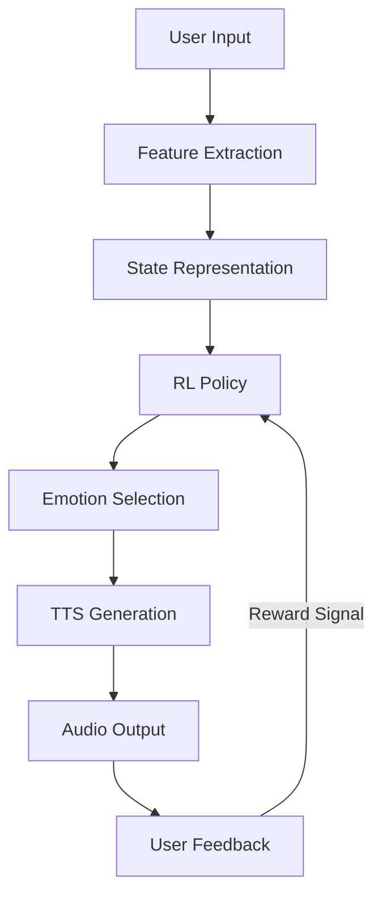

# HumanVoiceAI: Reinforcement Learning Pipeline

This document provides an overview of the RL pipeline implementation for emotion selection in the HumanVoiceAI project.

## Architecture Overview



## Key Components

### 1. RL Environment (`src/human_voice_ai/rl/environment.py`)
- Implements the Gym interface for RL training
- Handles state representation and reward calculation
- Manages interaction with TTS and SER models

### 2. Policy Network (`src/human_voice_ai/rl/agent.py`)
- Neural network for emotion selection
- Implements PPO algorithm for policy optimization
- Handles experience replay and training logic

### 3. Training Script (`scripts/train_rl_agent.py`)
- End-to-end training pipeline
- Handles logging and model checkpointing
- Includes evaluation and visualization

## Getting Started

### Prerequisites
- Python 3.8+
- PyTorch 2.0+
- CUDA (for GPU acceleration)

### Installation

1. Create a virtual environment:
   ```bash
   python -m venv venv
   source venv/bin/activate  # On Windows: venv\Scripts\activate
   ```

2. Install dependencies:
   ```bash
   pip install -r requirements-rl.txt
   ```

### Training

To train the RL agent:

```bash
python scripts/train_rl_agent.py \
    --device cuda  # or 'cpu' if no GPU available
```

### Monitoring Training

Monitor training progress with TensorBoard:

```bash
tensorboard --logdir=logs/rl_training
```

## Configuration

Training hyperparameters can be modified in the `RLTrainingConfig` class within the training script.

## Model Architecture

The policy network consists of:
- Audio feature processing branch
- Text feature processing branch
- Combined network with attention
- Separate heads for policy and value functions

## Evaluation

To evaluate a trained model:

```python
from src.human_voice_ai.rl.agent import PolicyNetwork
from src.human_voice_ai.rl.environment import create_environment

device = 'cuda' if torch.cuda.is_available() else 'cpu'
model = PolicyNetwork().to(device)
model.load_state_dict(torch.load('saved_models/policy.pt'))

env = create_environment()
state = env.reset()

done = False
while not done:
    state_tensor = {k: torch.FloatTensor(v).unsqueeze(0).to(device) 
                   for k, v in state.items()}
    with torch.no_grad():
        action = model.act(state_tensor, epsilon=0.0)
    state, _, done, _ = env.step(action)
```

## Contributing

1. Fork the repository
2. Create a feature branch
3. Commit your changes
4. Push to the branch
5. Open a pull request

## License

This project is licensed under the MIT License - see the [LICENSE](LICENSE) file for details.

## Contact

- **Jaden Fix**
- GitHub: [jadenfix](https://github.com/jadenfix)
- LinkedIn: [jadenfix](https://linkedin.com/in/jadenfix)
- Email: jadenfix123@gmail.com
